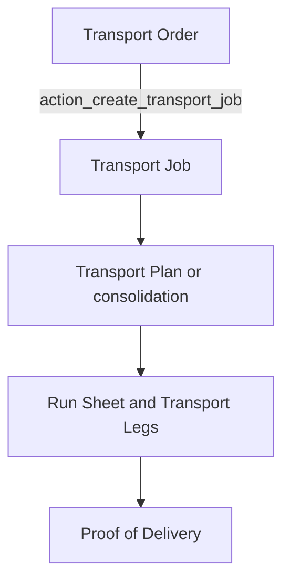

# CargoNext application review

This review describes how the CargoNext logistics app is built: the modules, the document lifecycles, and the shared engines that connect quoting, operations, and accounting. It is a read of the code in this repository. It is not a runtime test of every desk screen.

CargoNext is a Frappe application that depends on ERPNext (`app_dependencies` in `logistics/hooks.py`). The product name in that file is CargoNext. The Python package and git repository are named `logistics`.

## How the app is organized

Frappe loads modules from `logistics/modules.txt`:

| Module | Package |
| --- | --- |
| Logistics | `logistics/logistics` |
| Transport | `logistics/transport` |
| Warehousing | `logistics/warehousing` |
| Customs | `logistics/customs` |
| Global Customs | `logistics/global_customs` |
| Sea Freight | `logistics/sea_freight` |
| Air Freight | `logistics/air_freight` |
| Job Management | `logistics/job_management` |
| Pricing Center | `logistics/pricing_center` |
| Sustainability | `logistics/sustainability` |
| Netting | `logistics/netting` |
| Special Projects | `logistics/special_projects` |
| Intercompany | `logistics/intercompany` |
| Cash Advance | `logistics/cash_advance` |
| MICE | `logistics/mice` |
| High Value | `logistics/high_value` |
| Time Sensitive | `logistics/time_sensitive` |
| Control Tower | `logistics/control_tower` |

Two packages sit beside those modules and are not listed in `modules.txt`:

- `logistics/exhibits` holds Exhibit, Docket, and exhibit-order controllers. MICE covers a similar exhibition programme (MICE Project, Docket, MICE Order). Both trees are present.
- `logistics/logistics_sales` holds two Sales Quote break DocTypes (`Sales Quote Qty Break`, `Sales Quote Weight Break`). The live quoting model is in Pricing Center.

Other packages are services rather than Frappe modules: `utils`, `invoice_integration`, `billing`, `document_management`, `status_update`, `bir_cas`, `print_format`, `container_management`, `lalamove`, `integrations`, `operations_dashboard`, `www`. A separate installable app, `workflow_center/`, lives at the repository root and lists open Workflow Actions across DocTypes.

Desk JavaScript is loaded in two layers from `logistics/hooks.py`. `app_include_js` is global (charges, linked services, credit-adjacent form helpers, profitability, time-sensitive timer). `doctype_js` attaches scripts to a named DocType. `page_js` covers Workflow Center, the air and sea control-tower pages, and the role-permission matrix.

The same shape repeats in every operational vertical: a commercial document, a planning document, an execution document, then ERPNext invoices and recognition journals.

## Commercial to operational flow

**Sales Quote** (`logistics/pricing_center/doctype/sales_quote/sales_quote.py`) is the commercial hub. It validates routing, linked-service charge scope, time-sensitive deadlines, and profitability. On submit, additional-charge lines can be pushed onto an existing job (`additional_charge_to_job.py`). One-off quotes create the operational document from the quote. Regular quotes are applied later with Get Charges from Quotation.

`logistics/pricing_center/sales_quote_booking_creation.py` (`create_booking_or_order_from_sales_quote`) creates the planning document for the quote’s main service and clones linked services onto it:

| Main service | Planning document | Execution document |
| --- | --- | --- |
| Air | Air Booking | Air Shipment |
| Sea | Sea Booking | Sea Shipment |
| Transport | Transport Order | Transport Job, then Run Sheet |
| Customs | Declaration Order | Declaration |
| Warehouse | Inbound, Release, Transfer, VAS, Stocktake, or Cross-Docking Order | Warehouse Job |
| Programme | Special Project, MICE Project, Docket, Time Sensitive Case | Project Job, MICE Job, or downstream bookings |

**Change Request** (`logistics/pricing_center/doctype/change_request/`) is the post-submit amendment path. `logistics/job_management/job_change_lock.py` blocks direct edits on a submitted job. Submitting the change request applies field patches and charge deltas (`change_request_field_apply.py`, `change_request_to_job.py`).

**Job Number** (`logistics/job_management/doctype/job_number/`) is the registry row that ties an operational document to accounting dimensions. Header estimated revenue and cost are rolled up from charge lines on validate (`logistics/job_management/doc_events.py`).

## Pricing Center

Parent documents: Sales Quote, Sales Quote Pack, Change Request, Cost Sheet, Tariff, Pricing Center Settings, Get Charges from Quotation Settings, plus zoning and exchange-rate masters.

Sales Quote is about 5,160 lines. Child charge `validate` does not run on parent save in this Frappe version, so the parent explicitly syncs tariff rates and breaks after save. Pack-linked quotes cannot submit on their own.

Tariff (`tariff.py`) validates type and dates and serves rates through `get_tariff_rates`. Shared calculation lives in `logistics/utils/rate_calculation_engine.py` and `logistics/utils/charges_calculation.py` (`calculate_charge_row`).

Service-line controllers under `sales_quote_transport` and `sales_quote_sea_freight` calculate the transport and sea tabs. Charge child DocTypes for operational jobs (Transport Order Charges, Transport Job Charges, and the air, sea, warehouse, and customs charge tables) also live in this module, and `hooks.py` attaches their scripts to the operational forms.

## Air Freight

Parent documents: Air Booking, Air Shipment, Air Consolidation, Master Air Waybill, Air Shipment IATA Transaction, airline and flight masters, IATA Settings, IATA Message Queue, CASS File, CASS Settlement Period, MAWB Stock Range, Unit Load Device, Dangerous Goods Declaration, Air Freight Settings.

**Booking to shipment.** `AirBooking.convert_to_shipment` (`air_booking.py`, about 3,200 lines) creates one Air Shipment and copies charges, packages, and routing. Submit and cancel update a one-off Sales Quote. `AirShipment.validate` (`air_shipment.py`, about 3,960 lines) checks AWB, ULD, dangerous goods, and a unique linked booking, then calls `sync_air_shipment_job_status`.

**Job status.** `logistics/job_management/logistics_job_status.py` derives `job_status` from milestone rows. The shared options are Draft, Submitted, In Progress, Completed, Closed, Reopened, Cancelled. Reopened and Closed are preserved so the charge-reopen workflow is not overwritten.

**Consolidation.** `AirConsolidation` (about 1,670 lines) checks capacity, shipment compatibility, and dangerous-goods segregation. `preview_matching_air_shipments` and `fetch_matching_air_shipments` fill the consolidation. An update can send an electronic air waybill.

**Integrations.**

- Electronic air waybill: `logistics/air_freight/iata_cargo_xml/eawb_service.py` and `MasterAirWaybill.submit_eawb`. Inbound Cargo-XML is `receive_cargo_xml` in `api/iata_cargo_xml_api.py`.
- CASS: `logistics/air_freight/casslink/sftp_client.py`, pulled daily by `pull_configured_companies`.
- Live flights: `flight_schedules/tasks.py` syncs OpenSky every 10 minutes and updates job flight status hourly.

Tests under `logistics/air_freight/tests/` cover electronic air waybill, CCS, CASS, and consolidation.

## Sea Freight

Parent documents: Sea Booking, Sea Shipment, Sea Consolidation, Master Bill, Shipping Line, Vessel, Container Yard, Cargo Terminal Operator, Sea Cut Off, Other Service, Sea Freight Settings.

Sea Booking mirrors air booking (`sea_booking.py`, about 3,200 lines): validate, submit gates, `convert_to_shipment`, and the whitelisted `convert_to_shipment_api`. Sea Shipment (about 2,100 lines) validates routing, containers, and the master bill, copies milestones, and calls `sync_sea_shipment_job_status`. `shipping_status` is the operational pipeline. `job_status` is derived from it: Delivered and Empty Container Returned become Completed; a Closed shipping status becomes Closed. Submit can call the sustainability integration.

Sea Consolidation uses the same preview-and-fetch matching pattern as air. Master Bill refreshes voyage status through GoConnect (`refresh_voyage_status`, `fetch_and_link_vessel_schedule`). `logistics/sea_freight/vessel_tracking/api.py` is a compatibility wrapper around `goconnect.api.sea.get_vessel_position_for_map`.

Daily container reconciliation is `logistics.container_management.api.reconcile_containers_from_terminal_sea_shipments`.

`logistics/sea_freight/tasks.py` defines `check_sea_shipment_delays`, `check_sea_shipment_penalties`, `check_impending_penalties`, and `check_container_penalties`. Those functions are not registered in `scheduler_events` in `hooks.py`. The Sea Shipment DocType description still contains developer notes asking for penalty and delay alerts.

## Transport

Parent documents that carry the flow: Transport Order, Transport Job, Transport Leg, Run Sheet, Transport Consolidation, Transport Plan, Dispatch, Dispatcher, Trip, Proof of Delivery, Transport Vehicle, capacity and truck-ban masters, telematics event storage, Transport Settings.

**Transport Order** (`transport_order.py`, about 3,250 lines) validates legs, load and vehicle compatibility, and truck bans. Submit updates a one-off quote and can post Special Project site receipts. `action_create_transport_job` creates or reuses the job from a submitted order.

**Transport Job** (`transport_job.py`, about 2,590 lines) derives status from legs, syncs containers, and can create a run sheet and a sales invoice. Status corrections are written with `frappe.db.sql` inside `before_save` and `before_submit` (for example, forcing `status` from Draft to Submitted when `docstatus` is already 1) and call `frappe.db.commit()` from the controller.

**Run Sheet** (`run_sheet.py`) validates vehicle, capacity, and leg compatibility. Driver mobile calls live in `logistics/transport/api.py`: `get_run_sheet_bundle`, `apply_leg_driver_updates`, `update_driver_location`.

**Transport Plan** (`auto_allocate_and_create`) assigns vehicles and drivers and creates or reuses run sheets. **Transport Consolidation** matches jobs and legs and builds a run sheet (`create_run_sheet_from_consolidation`).

**Capacity** is a small package: `logistics/transport/capacity/` (`capacity_manager.py`, `capacity_reserver.py`, `vehicle_type_capacity.py`). Address windows and economic-zone rules validate on Address (`address_windows.py`, `address_eza.py`).

**Telematics** ingest is delegated to GoConnect. `logistics/transport/telematics/resolve.py` and `jobs.py` re-export that package. `api_vehicle_tracking.py` and `customer_portal.py` serve the customer portal, including `Transport Vehicle.last_telematics_*`.

**Thin or unused documents.** `ODDSOrder` and `ProofofDelivery` are empty `Document` subclasses (`pass`). Plate Coding Rule’s description says it is deprecated in favor of Truck Ban Constraint and is no longer enforced.

Special Project deliveries are posted on Transport Job submit, not on Transport Order submit (`special_project_packages.on_transport_job_submit` in `hooks.py`).

## Warehousing

Planning documents: Inbound Order, Release Order, Transfer Order, Cross-Docking Order, Stocktake Order, VAS Order. Each exposes `make_warehouse_job`, which maps the order into a Warehouse Job and saves it.

**Warehouse Job** (`warehouse_job.py`, about 5,370 lines) is the largest controller in the app. `before_save` fills contract charges and sustainability totals. `on_submit` checks lines and locations and writes Warehouse Stock Ledger rows. Putaway posts a positive quantity, Pick posts a negative quantity, and Move and Stocktake post the signed quantity on the row. Whitelisted helpers allocate items, create operations, and post standard costs.

Supporting masters include Warehouse Contract, Warehouse Item, Storage Location, Handling Unit, Dock Door, Gate Pass, Periodic Billing, and batch and serial records. Web forms exist for inbound, release, transfer, stocktake, and VAS.

There is no `test_warehouse_job.py`. Order, contract, and gate-pass tests exist.

## Customs and Global Customs

**Declaration Order** is the planning document created from a Sales Quote. `before_submit` requires a quote except for time-sensitive operations. **Declaration** (`declaration.py`, about 2,300 lines) is the clearance job. `sync_declaration_job_status` keeps customs `status` and billing `job_status` apart. Submit can call sustainability. Whitelisted methods create a declaration from an order or a quote and can raise a sales invoice.

**Global Manifest** groups house bills and can be created from a sea shipment, an air shipment, or a transport order (`create_from_sea_shipment`, `create_from_air_shipment`, `create_from_transport_order`).

**Permit matching** (`logistics/customs/permit_matching.py`) links Permit Application records to shipments, jobs, commodities, and parties by tags. Daily jobs in `logistics/status_update/tasks.py` refresh document, permit, and exemption statuses when Logistics Settings has automatic status updates enabled.

Country filing documents are first-class DocTypes: US AMS, US ISF, CA eManifest Forwarder, JP AFR. Their API clients are stubs. `USAMSAPI` in `logistics/customs/api/us_ams_api.py` is documented as a stub that returns mock responses and falls back to `https://api.cbp.gov/ams/v1`.

**Global Customs** (`logistics/global_customs/`) defines no DocTypes. It is a set of script reports on Global Manifest (executive snapshot, workflow pipeline, submission health, bill volume, owner workload, carrier and party concentration). The operational DocType stays in Customs.

## Job Management

This module does not own the freight or warehouse jobs. It owns the accounting behavior around them.

- **Estimates.** `on_job_validate_estimates` rolls header estimated revenue and cost from charge lines.
- **Recognition.** `RecognitionEngine` in `recognition_engine.py` posts work-in-progress journals for estimated revenue and accrual journals for estimated cost, then adjustment journals when actuals arrive. `close_job_recognition` handles closure. Policy is `Recognition Policy Settings`, matched per company and job.
- **Auto recognition.** `enqueue_auto_recognize` runs on submit and on update after submit. A daily job, `process_auto_recognition`, retries jobs whose policy date is ready. Covered types include Special Project and Docket as well as freight and warehouse jobs.
- **Readiness.** `job_readiness.py` blocks complete and close when required documents, milestones, or unposted charges fail Logistics Settings checks.
- **Lock and reopen.** Submitted jobs reject direct edits. Charge grids lock at Completed and Closed; `charge_reopen.py` reopens them.
- **Dimensions.** `gl_item_dimension.py` and `gl_reference_dimension.py` push Item and Job Number dimensions onto journal entries. Sales Invoice and Purchase Invoice validate hooks sync the same dimensions (`invoice_integration/`).
- **Job 360.** `job_360.py` aggregates GL, receivables, payables, and recognition aging by Job Number.

Invoice submit updates the job and the charge-row invoice status in `logistics/invoice_integration/lifecycle.py`.

## Special Projects

**Special Project** is a programme: lifecycle stages, services, packages, and charges. `before_submit` blocks until packages are delivered and lifecycle activities are complete. `special_project_booking_creation.py` creates operational bookings from services, in parallel with the quote booking factory. `special_project_packages.py` folds Air Shipment, Sea Shipment, and Transport Job submissions into the project’s deliveries. `lifecycle_job_financial_rollup.py` rolls operational-job financials back onto lifecycle rows; `hooks.py` attaches that handler to the operational DocTypes’ update and submit events.

**Project Order** creates **Project Job**. Project Job creates a Job Number and, on submit, posts site receipts from packages.

`special_project_service_persistence.py` syncs the virtual services grid to Special Project Service documents on save and deletes them when the project is trashed.

The live execution DocTypes are Project Job and Project Order. `special_project_job.py` remains as a shim that subclasses `ProjectJob` so an old import path still loads. The JSON files that pointed at the removed `project_task_job` and `project_task_order_job` folders are gone.

## MICE

**MICE Project** is the show or exhibit programme. Its dockets grid is a virtual child (`MICE Project Docket`). `allocate_costs` spreads project cost across dockets. **Docket** is the exhibitor shipment: packages, charges, linked services, and a Job Number. Customer is taken from the MICE Organizer. **MICE Order** creates a **MICE Job**.

Docket creation from a Sales Quote and linked-service healing on load follow the same pattern as Special Projects. Docket is included in auto-recognition. Print formats for the manifest and consolidation profit are registered as Jinja methods in `hooks.py`.

## Time Sensitive

**Time Sensitive Case** coordinates an urgent move. `validate` enforces `ALLOWED_TRANSITIONS`. `on_submit` activates the case from Draft or Triage and stamps attached documents. `orchestration.py` builds a case from a Sales Quote and maps each linked service to a default booking DocType. `propagation.py` writes `is_time_sensitive`, the case link, and deadline fields onto downstream jobs. `service_linking.py` creates the Linked Service owned by the case.

`ts_sq_fetch.py` (`preview_fetch`, `apply_fetch`) is the bidirectional fetch between the case and the Sales Quote. `sla.py` computes SLA status. `tasks.monitor_time_sensitive_cases` runs every five minutes.

The case form uses the same virtual linked-services grid as Sales Quote and Change Request.

## High Value

The only parent DocType is **HV Brands**. The rest of `logistics/high_value/` is analytics: a workspace dashboard (`high_value_operations_dashboard.py`) and script reports for quote pipeline, job health, modality mix, SLA aging, and a brand board. Those reports read Sales Quote plus Air Shipment, Sea Shipment, Transport Job, Declaration, and Warehouse Job. They do not own those documents.

## Control Tower

Control Tower is an executive register plus read-only SQL. Seeded documents include Control Tower Organization, GP Target, Pipeline Entry, Risk Register Entry, Returned Billing, Client Credit Line, and HR, IT, and asset logs. `control_tower/api.py` aggregates jobs and milestones across sea, air, transport, declaration, warehouse, project, exhibit, and MICE sources. The module docstring states that cross-currency amounts are summed with no foreign-exchange conversion. GP uses both estimated and recognized fields.

`permission_query_conditions` in `hooks.py` scopes Organization, GP Target, Pipeline Entry, Risk Register Entry, and Returned Billing through `control_tower/permissions.py`. `control_tower/install.py` runs on install and migrate and rebuilds dashboards, charts, and number cards from `seed_data.py`.

Separate desk pages, Air Freight Control Tower and Sea Freight Control Tower, are wired in `page_js` and live with the freight modules.

## Sustainability

Records: Carbon Footprint, Energy Consumption, Sustainability Metrics, Goals, Compliance, and emission-factor masters. **Sustainability Settings** is per company and gates which modules write records.

`logistics/sustainability/api/integration_layer.py` creates carbon, energy, and metric rows from a transport leg, a warehouse job, or an air or sea shipment when that module is enabled. General Job calls `integrate_sustainability` on `after_submit`. Transport also has `logistics/transport/carbon.py`.

## Netting

**Settlement Group** lists the settlement customer or supplier and the member parties. **Settlement Entry** is the submittable run. `validate` checks membership and exchange rates. `on_submit` creates a balancing Journal Entry (`create_journal_entry`). `on_cancel` cancels that journal. Outstanding Sales Invoices and Purchase Invoices are discovered from the group (`get_all_outstanding_transactions`). Exchange gain and loss is plugged in the same controller. There is no link to quotes or jobs.

## Intercompany

**Intercompany Settings** stores billing and operating company pairs. **Intercompany Invoice Log** records generated pairs.

`create_intercompany_invoices_from_sales_invoice` in `intercompany_invoice.py` runs when a customer Sales Invoice is submitted and `quotation_no` points at a Sales Quote. For each internal job whose operating company differs from the main job’s company, it creates an intercompany Sales Invoice and Purchase Invoice. Eligible job types are Transport Job, Air Shipment, Sea Shipment, Warehouse Job, Declaration, and Declaration Order. The operating-company invoice is marked with the untranslated remarks prefix `Intercompany:` so the submit hook does not recurse. Wiring is in `invoice_integration/invoice_hooks.py`, not in a `doc_events` entry of its own.

## Cash Advance

**Cash Advance Request**, **Cash Advance Liquidation**, and **Cash Acknowledgment** are submittable. Settings hold due-date policy, limits, and fund-source rules.

Request `before_submit` blocks a payee who still has an overdue unliquidated advance, checks the fund source, and requires a Job Number when the fund source says so (`job_number_rules.py`). Item codes on lines are limited to items already used on that job’s charges (`job_charge_items.py`). `on_submit` posts the advance-release Journal Entry through `accounting.py`. Liquidation posts the offset. `cash_advance/install.py` runs from `after_migrate`.

## Shared Logistics module

`logistics/logistics/` is master data and the cross-module documents, not the freight jobs.

Party and network masters include Agent Network, Broker, Freight Agent, Shipper, Consignee, and Customs Authority. Equipment masters include Container and its types, vehicle type, and load type. Templates include Lifecycle Template, Milestone Template, and Document List Template.

**Linked Service** is the hub for multimodal and internal legs. See the engine section below.

**General Job** is a miscellaneous submittable job. It creates a Job Number and calls sustainability on submit, and it participates in recognition.

**Credit Hold Lift Request** is the temporary exception to credit control. **Logistics Settings** holds credit rules, permit alerts, container-deposit accounts, and temperature limits.

**Container** validates identity and exposes deposit and charge helpers used by invoice hooks.

## Cross-cutting engines

### Charges

Get Charges from Quotation (`logistics/public/js/get_charges_from_quotation.js` and `logistics/utils/get_charges_from_quotation.py`) lists submitted Regular quotes for the job’s customer, previews charge cards, and applies them. One-off quotes are excluded from that dialog; their jobs are created from the quote. Apply writes `sales_quote`, routing on sea and air, and charge rows, then the parent save runs the normal calculation.

The product rules in the Python module docstring:

- Customer match uses `local_customer` on sea and air and `customer` on Transport Order.
- Dialog filters can widen the list. Apply still requires the quote to match the document saved on disk.
- Branch, cost center, and profit center on the quote must equal the job or be blank.

Get Charges from Tariff (`get_charges_from_tariff.js`, `utils/get_charges_from_tariff.py`) copies tariff rows through `utils/tariff_charge_copy.py`.

Row math is `calculate_charge_row` in `utils/charges_calculation.py`, which delegates to `RateCalculationEngine`. The desk script `charges_disbursement_sync.js` copies the disbursement mirror from that response back onto the grid. Weight, quantity, and percent breaks, plus specified charges, are dialogs in `charge_break_dialogs.js`.

### Credit control

`logistics/utils/credit_management.py` applies when Logistics Settings has `enable_credit_control`. Hold reasons are customer status On Hold or Watch, an ERPNext credit-limit breach, and overdue Sales Invoices past `credit_payment_terms_grace_days`. The customer is read from `customer`, `local_customer`, `booking_party`, or `controlling_party` when that field links to Customer.

Rules are per DocType (`credit_control_rules`) or all subject DocTypes when `credit_apply_hold_to_all_doctypes` is set. Actions are block insert, block save (warning on validate), block submit, and block print. Administrator and `credit_control_bypass_role` skip the checks. `merge_credit_hooks` registers the handlers at the bottom of `hooks.py`. Print is enforced by patching `frappe.www.printview.validate_print_permission`.

A submitted **Credit Hold Lift Request** whose dates cover today suppresses the hold for one document or for all documents of that customer. `before_submit` requires Credit Manager or System Manager.

Subject DocTypes include Sales Quote, the air and sea booking and shipment pair, transport order and job, declaration and declaration order, warehouse job and the warehouse orders, Special Project, General Job, Gate Pass, Periodic Billing, and Warehouse Contract.

### Linked services and internal jobs

A linked leg is a **Linked Service** document (names such as `IJ-…`). The form shows it as a child grid (`linked_services` or, on some warehouse parents, `internal_job_details`).

`logistics/utils/internal_job_persistence.py` writes the grid to Linked Service documents on `before_save` and deletes removed rows on trash. `virtual_linked_services_view.py` builds the grid for parents that do not store the child table physically. `linked_service_usage.py` records which booking or job consumed a service so the grid can show order and job numbers. The desk dialog is `public/js/linked_services_dialog.js`. Creating an operational document from a row goes through `public/js/internal_job_create_from_source.js` and `utils/internal_job_from_source.py`.

Sales Quote owns its linked services. Usage rows let a booking show quote-owned services without re-parenting them (`linked_service.py`).

### Documents and milestones

`hooks.py` lists the parents that carry Documents and Milestones tabs (`_doc_milestone_doctypes`): air and sea bookings, shipments, and consolidations; transport order and job; declaration and declaration order; warehouse orders and warehouse job; general job; special project; time-sensitive case; project order and job; and the MICE family.

`document_management/api.py` fills those tables from templates on save, syncs milestone dates, and can block submit when required job documents are pending. Hourly, `status_update.tasks.update_milestone_statuses` marks milestones Delayed after `planned_end`. Daily jobs refresh document, permit, and exemption statuses. All of them honor `Logistics Settings.enable_auto_status_updates`.

### Portals

Website pages are Frappe `www` files, not `website_route_rules`. Customer-facing pages include:

| Path | Module |
| --- | --- |
| `/warehousing_portal` | `www/warehousing_portal.py` |
| `/warehouse_jobs` | `www/warehouse_jobs.py` |
| `/inbound_orders`, `/release_orders`, `/transfer_orders`, `/stocktake_orders`, `/vas_orders` | matching `www` modules |
| `/stock_balance` | `www/stock_balance.py` (also standalone and minimal variants) |
| `/transport_jobs`, `/transport_job_detail`, `/transport_portal` | `www/` and a second copy under `transport/www/` |

`logistics/transport/customer_portal.py` exposes customer jobs and vehicle position for the portal. `logistics/api_backup.py` is a second, older portal API (customer resolution, warehouse-order creators, and debug methods).

### Scheduled work

| When | What |
| --- | --- |
| Every 10 minutes | OpenSky flight sync |
| Every 5 minutes | Time-sensitive case monitor |
| Hourly | Milestone delays, air-job flight status, Outlook task reconcile, transport SLA |
| Daily | Document, permit, and exemption statuses; sea-terminal container reconcile; flight-schedule cleanup; CASS SFTP pull; auto recognition |

### Print, PDF, and BIR CAS

`override_whitelisted_methods` replaces standard PDF download with `print_format/payment_entry/bank_forms_pdf.py` (BDO telegraphic transfer) and replaces query-report export with `bir_cas/export_query.py`, which adds BIR CAS Excel headers for reports named in `bir_cas/constants.py`. Jinja methods cover sales-invoice disbursement and VAT lines, MICE manifest and consolidation profit, and purchase-invoice header helpers.

`override_doctype_class` replaces Transaction Deletion Record so company-scoped setup DocTypes in `company_data_to_be_ignored` survive company data deletion. Dashboards for Opportunity, Lead, Customer, and Prospect are replaced by Pricing Center dashboard modules.

### Other integrations

- **Lalamove.** `logistics/lalamove/` is a client, mapper, and `LalamoveService`. `hooks.py` does not register it. `sea_shipment_lalamove.js` and ODDS Settings already reference Lalamove, and that script is not in `doctype_js`, so the Sea Shipment form does not load the button.
- **Outlook.** `integrations/outlook/tasks.py` reconciles failed syncs and pulls recent task changes hourly.
- **GoConnect.** Vessel tracking and land telematics call into that package instead of keeping provider clients in this app.

## Code findings

These are observations from the files named. They are not a defect list from a running site. Prioritized next steps are in [docs/FIXES_AND_RECOMMENDATIONS.md](FIXES_AND_RECOMMENDATIONS.md).

1. **Controllers concentrate too much behavior.** Warehouse Job is about 5,370 lines, Sales Quote about 5,160, Air Shipment about 3,960, Transport Order about 3,250, Air Booking and Sea Booking about 3,200 each, Transport Job about 2,590, Declaration about 2,300. Air and sea booking-to-shipment conversion follow the same structure in two files.

2. **Transport Job writes status with raw SQL and commits inside the document controller.** `transport_job.py` updates ``tabTransport Job`.`status`` with `frappe.db.sql` and calls `frappe.db.commit()` while save and submit hooks are still running. That bypasses the document model and can commit partial work.

3. **Sea delay and penalty jobs are implemented and not scheduled.** `sea_freight/tasks.py` defines the four check functions. `hooks.py` `scheduler_events` does not call them. The Sea Shipment description still asks for those alerts as developer notes.

4. **Customs filing clients are stubs.** `customs/api/us_ams_api.py` documents itself as a mock implementation. The sibling clients for US ISF, CA eManifest, and JP AFR follow the same pattern. Filing DocTypes and compliance reports exist; a live customs endpoint does not.

5. **Special Project JSON symlinks were removed.** `special_project_job.json` and `special_project_order_job.json` pointed at `project_task_job` and `project_task_order_job` folders that are not in the tree. Those links are gone. `special_project_job.py` still subclasses `ProjectJob`. Project Job and Project Order are the live DocTypes.

6. **Portal and debug leftovers are in the app tree.** Transport has several one-off menu scripts (`add_portal_items.py`, `add_portal_items_to_settings.py`, `add_to_portal_settings.py`, `create_portal_items.py`, `check_and_create_pages.py`, `check_portal_structure.py`). `api_telematics_debug.py` is a whitelisted device listing. `www/` includes `transport_debug.html`, `warehousing_debug.html`, `test_portal.html`, `simple_test.html`, and `transport_portal_old.html`. A second portal package exists at `transport/www/`. `api_backup.py` duplicates portal APIs.

7. **Empty and deprecated DocTypes are still installed.** `ODDSOrder` and `ProofofDelivery` do nothing. Plate Coding Rule’s own description says it is deprecated and no longer enforced.

8. **`user_data_fields` in `hooks.py` is an empty list.** The framework placeholders `{doctype_1}` and `{field_1}` were removed so Frappe does not look up those names. Personal data is not redacted until a privacy pass names real DocTypes.

9. **`hooks.py` merges document events at import time.** Credit, special-project financials, freight-shipment receipts, and transport-job receipts append handlers onto `doc_events` with list-merging loops. The final handler list for a DocType is not visible in the original dictionary.

10. **Exhibits and MICE both implement exhibition programmes.** `modules.txt` registers MICE and does not register Exhibits. `logistics/exhibits/` still contains Exhibit, Docket, and lifecycle code, and Control Tower’s job sources still mention exhibits.

11. **Global `app_include_js` is long.** Charge dialogs, linked services, profitability, invoice dialogs, and the time-sensitive timer load on every desk page. Many of those scripts are also listed again under `doctype_js`.

12. **The Lalamove desk button is not loaded.** The client and service exist, and `sea_shipment_lalamove.js` plus ODDS Settings reference them. `hooks.py` does not list that script under `doctype_js`, so Sea Shipment does not show the button.

## Test coverage

`test_*.py` counts by top-level package:

| Tests | Package |
| ---: | --- |
| 70 | `utils` |
| 29 | `logistics` |
| 26 | `air_freight` |
| 21 | `special_projects` |
| 20 | `transport` |
| 16 | `pricing_center` |
| 13 | `sea_freight` |
| 12 | `mice` |
| 10 | `job_management` |
| 10 | `invoice_integration` |
| 8 | `customs`, `print_format` |
| 7 | `warehousing` |
| 5 | `exhibits` |
| 3 | `time_sensitive`, `high_value`, `cash_advance` |
| 2 | `netting` |
| 1 | `billing`, `bir_cas`, `integrations`, `workflow_center` |

These packages have no `test_*.py` files: `control_tower`, `sustainability`, `intercompany`, `document_management`, `status_update`, `container_management`, `global_customs`, `lalamove`, `analytics_reports`, `operations_dashboard`, and `www`. Warehousing’s execution controller, Warehouse Job, has no dedicated test module.

Air freight, pricing utilities, and the shared `utils` package are the strongest automated coverage. Control Tower SQL, sustainability writers, intercompany invoice creation, and the document/milestone scheduler are not.

## What this review does not claim

Screen behavior, permissions of a live site, and performance under production data were not exercised. A function that exists and is unscheduled, stubbed, or empty is reported as that. It is not reported as a production incident.
