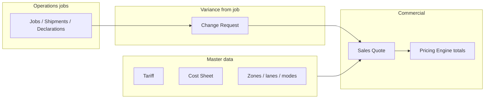

# Process Scoping: Pricing Module

**Audience:** Product, operations, finance, IT  
**Purpose:** Align on what the Pricing module does today, which processes we govern, boundaries, and decisions needed before deeper design or rollout.

> **Tip:** Each `---` block can be treated as one slide in Marp, Slidev, or similar tools. Headings use `##` for slide titles.

---

## Slide 1 — Title

**Process Scoping Workshop**  
**Pricing Module** (Logistics app — Pricing Center)

- **Outcome:** Shared understanding of scope, owners, and open decisions
- **Inputs:** Current DocTypes, workspace layout, and cross-module touchpoints

---

## Slide 2 — Why this session

- **Clarify** which business processes live inside Pricing vs. adjacent modules (bookings, shipments, transport, customs).
- **Agree** on terminology: tariff vs. cost sheet vs. quote vs. change request.
- **Surface** gaps: approvals, versioning, integration contracts, reporting.
- **Prioritize** what to standardize first (master data, quoting, cost recovery, margin views).

---

## Slide 3 — Module snapshot (as implemented)

The **Pricing** workspace groups day-to-day and setup work around:

| Area | Primary artifacts |
|------|-------------------|
| **Quick access** | Sales Quote, Tariff, Cost Sheet, Change Request |
| **Master files & setup** | Organizations; transport & geography (zones, lanes, zip mapping, modes, vehicle types); rates & tariffs; module settings |
| **Analysis** | Revenue & billing; cost & margin; projects & performance (reports/cards as configured) |

**Central calculation concept:** A **Pricing Engine** rolls up amounts across **transport**, **air freight**, **sea freight**, **customs**, and **warehousing** lines on a **Sales Quote**.

---

## Slide 4 — Core data objects (process anchors)

1. **Tariff**  
   - Customer-facing **sell** rate structure: scoped by type (e.g. customer, group, territory, agent), validity dates, currency, and **tabs** for air, sea, transport, warehouse, and customs rates.

2. **Cost Sheet**  
   - **Buy** side: provider-linked (shipping line, airline, freight agent, transport company, broker, etc.), validity, currency, and charge lines.

3. **Sales Quote**  
   - Commercial offer: customer, parties (shipper/consignee), routing and service dimensions, **charges** and mode-specific sections (air/sea/transport/customs/warehousing), optional projects/resources/products, accounts dimensions, terms/SLA.  
   - **Status** includes lifecycle states such as **Draft** and **Converted** (read-only where configured).

4. **Change Request**  
   - Links a **job** (transport job, warehouse job, air/sea shipment, declaration) to proposed **charge** changes; tracks **Draft → Submitted → Approved → Sales Quote Created** and stores the resulting **Sales Quote** link.

---

## Slide 5 — End-to-end process map (high level)



**Narrative:** Masters constrain **how** we price; **Sales Quote** is the commercial record; **Change Request** is the controlled path when execution diverges and a new or revised quote is needed.

---

## Slide 6 — Process boundaries: in scope

Typical **in scope** topics for this module:

- Maintaining **tariffs** and **cost sheets** (who creates, who approves, how often refreshed).
- **Quoting** workflow: required fields per service type, use of templates/routing, multi-mode quotes.
- **Price calculation** consistency (totals and breakdowns by mode).
- **Change requests** from operational documents: eligibility, approval, and handoff to Sales Quote.
- **Workspace** access: which roles see setup vs. transactional vs. reports.
- **Integration** with charge tables on transport jobs/orders (client scripts and shared charge patterns).

---

## Slide 7 — Process boundaries: out of scope (or “adjacent module”)

Clarify with stakeholders; commonly **out of scope** for *Pricing* process definition alone:

- **Execution** documents (bookings, MAWB, B/L, declarations filing) — priced or linked, but process owned elsewhere.
- **ERP billing/invoicing** (unless explicitly modeled in this app) — interface and timing TBD.
- **Carrier operational APIs** — may **consume** rates; contract of which system is source of truth.
- **Credit control / legal** beyond terms templates on the quote.

Document **handoffs** at module boundaries to avoid duplicate ownership.

---

## Slide 8 — Stakeholders & ownership (to fill in workshop)

| Topic | Suggested owner | Notes |
|-------|-----------------|-------|
| Tariff policy & publication | | |
| Cost sheet updates (providers) | | |
| Quote approval limits | | |
| Change request approval | | |
| Master data (zones, lanes) | | |
| Reporting (margin, revenue) | | |

Use this table to assign **RACI** after the session.

---

## Slide 9 — Decisions checklist

1. **Single source of truth:** When Tariff and manual line on Sales Quote disagree, which wins and when?
2. **Cost sheet usage:** Mandatory for margin view on every quote line, or optional phase?
3. **Change Request:** Which job types require CR vs. direct quote amendment?
4. **Validity:** How do overlapping tariff/cost sheet date ranges resolve (priority rules)?
5. **Conversion:** What does **Converted** on Sales Quote imply operationally (booking only, invoice trigger, both)?
6. **Multi-currency:** FX timing and rounding rules for quotes vs. tariffs.
7. **Audit:** Track changes on masters — sufficient for compliance?

---

## Slide 10 — Metrics & success criteria (scoping phase)

- **Process clarity:** Documented swimlanes for Quote + Change Request + Master update (target: one page each).
- **Role clarity:** No ambiguous approver for tariff/cost/CR (target: named roles in RACI).
- **System clarity:** List of DocTypes and reports each process touches (inventory complete).
- **Risk register:** Top 5 integration or data-quality risks with owners.

---

## Slide 11 — Next steps

1. Confirm **in / out of scope** with sign-off from ops + commercial leads.  
2. Run a **walkthrough** on a real multi-mode Sales Quote and one Change Request.  
3. Fill **stakeholder table** and **decisions checklist**.  
4. Schedule **detailed design** only for items marked “in scope” and “decided.”  
5. Optionally export this deck to PDF/slides using your preferred Markdown-to-slides toolchain.

---

## Appendix A — Glossary (workshop)

| Term | Meaning in this app |
|------|---------------------|
| Tariff | Published sell rates, often segmented by customer dimension and service tabs |
| Cost Sheet | Buy rates by provider type and period |
| Sales Quote | Customer-facing priced offer; feeds Pricing Engine totals |
| Change Request | Job-linked request to adjust charges, ending in a linked Sales Quote when complete |
| Pricing Engine | Logic that aggregates quote amounts across transport, air, sea, customs, warehousing |

---

## Appendix B — Optional Marp front matter

If you use [Marp](https://marp.app/), you can prepend:

```yaml
---
marp: true
theme: default
paginate: true
header: 'Pricing Module — Process Scoping'
---
```

Then keep slide bodies between `---` separators as in this file.
