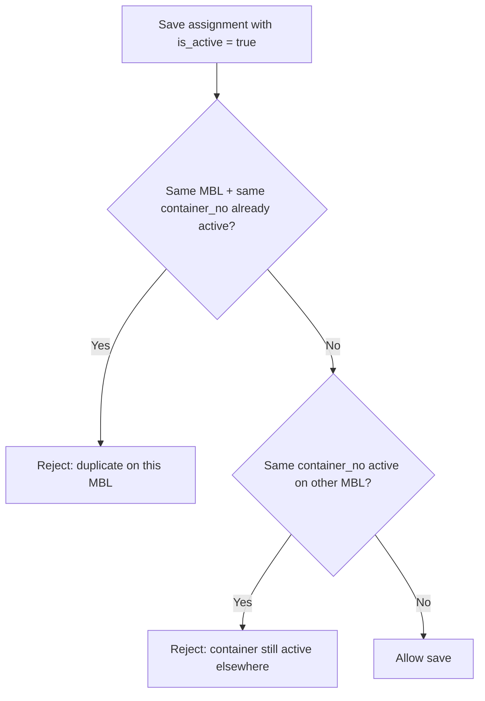

# Container Management (design)

This document describes **Container** management with an optional **Master Bill** assignment: tracking equipment in the context of a **master bill of lading** only—**not** persisting a sea shipment reference on the container record. At any moment, **operations monitor a single current row per physical container number** ( **`is_active`** ); history may contain many inactive rows for the same number.

**Implementation (app):** the **Container** DocType carries `master_bill`, `is_active` (“Active on Master Bill”), `assignment_inactive_date`, and `assignment_inactive_reason`. Document **name** is `{master_bill}-{container_number}` when **Master Bill** is set (with numeric suffix if needed), otherwise **name** stays equal to **container number** (legacy). Sea Shipment sync passes **`master_bill`** into `get_or_create_container` when present.

---

## 1. Purpose

- Record the **combination** of **container number** and **Master Bill** on the container-management record **without** storing **shipment_no** (house jobs can link outward to this record if needed; the record does not point back to a shipment).
- Support **full history**: the same `container_no` may appear on many rows over time (inactive).
- Enforce that **only one active assignment** exists per **(Master Bill, container_no)** pair.
- Enforce that a **container number cannot be active on a second Master Bill** while it remains **active** under any **existing** Master Bill—so **at most one active row exists per normalized container number** system-wide. That is the **single container record to monitor** at any given time for that equipment.

---

## 2. Core concept: **Container** + Master Bill

All of this lives on the **Container** DocType:

| Concept | Role |
| --- | --- |
| **Master Bill** | Optional link; when set, naming and assignment rules apply. |
| **Container number** | Normalized ISO 6346-style identifier (`container_number`). |
| **Active on Master Bill** (`is_active`) | Distinguishes the **one** current monitored row for that equipment number from closed or superseded rows. |

Type, seal, demurrage, depot links, etc. stay on the same **Container** document. **Sea Shipment** does not need a link field on **Container**; house files link **to** the **Container** name from child rows.

---

## 3. Document identity (name / ID)

**Requirement:** the document **name** (primary key) is derived from **Master Bill** and **container number**—**not** from shipment.

**Recommended pattern**

- **With Master Bill:** `{master_bill}-{normalized_container_number}` (hyphen), with `-2`, `-3`, … if the base name already exists.
- **Without Master Bill (legacy):** `name` = **container number** (single document per number in this mode).

If the composite string would exceed Frappe’s name length, a short hash segment is used in the prefix.

---

## 4. Duplicate container numbers (allowed)

- **Allowed:** many rows in the database with the same **container_no** (inactive history, different voyages, different Master Bills over time).
- **Not allowed:** two rows that are both **active** with the same **container_no** on **different** Master Bills (see §5.2).
- **Not allowed:** two rows that are both **active** with the same **(master_bill, container_no)** (see §5.1).

---

## 5. Business rules

### 5.1 Unique active pair: (Master Bill, container_no)

For any given **Master Bill**, at most **one active** row may exist per **container_no**.

- **Validation:** on insert / save when `is_active` (or equivalent) is true, query for another active row with the same `master_bill` and normalized `container_no`; if found, reject with a clear message.
- **Database:** partial unique index (where supported) or enforced in `validate()` plus a scheduled consistency check:  
  `(master_bill, container_no)` **unique** among rows with `is_active = 1`.

### 5.2 Global active exclusivity by container number

**Requirement:** do not allow creating (or re-activating) a row with **container_no** if that container is **still active** on **any** other **Master Bill**.

- **Validation:** when setting `is_active = true`, scan for **any** other active row with the same normalized `container_no` and a **different** `master_bill`. If found, reject: *“Container {no} is already active on Master Bill {other}.”*
- **Corollary:** this guarantees **exactly one active assignment per container number** at a time—the **single record to monitor** for that unit. Closing or deactivating it frees the number for activation on another MBL.

### 5.3 “Create” vs “activate”

- **Creating** a new assignment with `is_active = true` must run both §5.1 and §5.2.
- **Re-activating** an old historical row must run the same checks as create.

---

## 6. Lifecycle and “active”

Define explicit states, for example:

| State | Meaning |
| --- | --- |
| **Active** | The **current** monitored row for that container number; counts toward uniqueness rules; tied to exactly one Master Bill. |
| **Inactive / Closed** | Historical; does not block other Master Bills; same `container_no` may become active again elsewhere after no other row keeps it active. |

Closing should be tied to operational milestones where possible (e.g. **Empty Returned**, **Closed**, or explicit “Released from MBL” action) so the system state matches yard and carrier reality.

---

## 7. Integration with Sea Shipment and Master Bill

- **Sea Shipment** child tables (e.g. **Sea Freight Containers**) may still capture `container_no` for house documentation; they can **link** to the container-management record or **Container** asset where useful, but the **assignment record does not store `shipment_no`**.
- **Master Bill** link is mandatory on the assignment record when the design is MBL-centric (optional nullable only if product supports pre-MBL capture with a later “bind to MBL” step—then §5.2 applies when MBL is set and active).

---

## 8. Data model (**Container** DocType)

- `container_number` — required; no longer globally unique (duplicates allowed across inactive / MBL-scoped rows).
- `master_bill` — optional Link to Master Bill.
- `is_active` — “Active on Master Bill” (default on).
- `assignment_inactive_date`, `assignment_inactive_reason` — set when deactivating the MBL assignment.

**Omitted:** `shipment_no` on **Container**—monitoring is **per container number**, one active row at a time.

Indexes:

- `(master_bill, container_no, is_active)` for fast §5.1 checks.
- `(container_no, is_active)` for fast §5.2 checks.

---

## 9. Rule summary (diagram)

---

## 10. Relation to earlier behaviour

Previously **container_number** was **unique** and **name** always matched the number. Existing data keeps **name = container_number** with **master_bill** empty. New MBL-scoped rows use composite **name** values; **`get_or_create_container`** on Sea Shipment supplies **`master_bill`** when the shipment has one.

---

## 11. Open decisions

- Align **`is_active`** with **Container.status** / milestones (single source of truth).
- Whether **§5.2** should scope to **company** if multi-company shares equipment.

This design satisfies: **container number + Master Bill** on **Container**, **name** rules in §3, **duplicate numbers** when inactive, **one active row per container number globally**, and **no second active line while that number is active elsewhere**.
