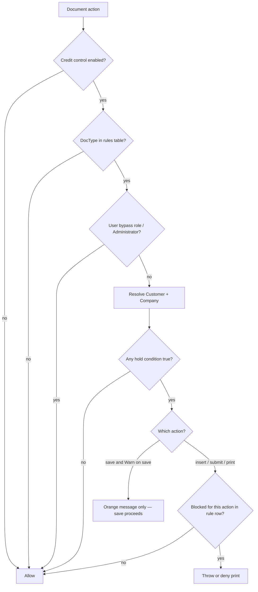

# Credit management (logistics-wide)

**Logistics credit control** ties **Customer** credit status, ERPNext limits and overdue invoices, and **Logistics Settings** rules so creation, submit, and print can be blocked while **save** only shows a warning. **Credit Hold Lift Request** provides a submitted, time-bound exception.

**Navigation**

- **Logistics Settings** (Credit Control tab): **Home > Logistics > Logistics Settings**
- **Customer** (Credit tab): **Home > Selling > Customer**
- **Credit Hold Lift Request**: open from Awesome Bar or list (Logistics module)

## Prerequisites

- [Logistics Settings](welcome/logistics-settings) saved with your company defaults
- **Customer** master data and (optional) ERPNext **Credit Limits** / **Payment Terms**
- Role **Credit Manager** (synced from app fixtures) for approving lift requests

## Goals

- One place to decide **which DocTypes** are subject to credit holds and **which actions** are blocked (new document, submit, print/PDF) or **warned** (save).
- Combine **manual** credit classification on the Customer with **automatic** signals from ERPNext (**credit limit**) and **overdue Sales Invoices** (payment terms deviation).
- Apply consistently to operational documents that link a **Customer** (or equivalent party field—see below).

## Customer: Credit tab

Custom fields on **Customer** (synced from the logistics app custom fixture):

| Field | Purpose |
|--------|---------|
| **Credit** (tab) | Groups logistics credit fields. |
| **Credit Status** (`logistics_credit_status`) | Select: **Good** (default), **Watch**, **On Hold**. Drives manual hold when enabled in settings. |

ERPNext’s own **Accounting** tab still holds **Payment Terms**, **Credit Limits** (per company), and **Credit Limit** on **Customer Group**—those feed the automated checks.

## Logistics Settings → Credit Control

Single DocType **Logistics Settings**, tab **Credit Control**.

### Master switch

- **Enable logistics credit control** — feature is off until this is checked.

### When is a customer “on hold”?

Any **enabled** condition below contributes; if at least one fires, the customer is on hold for enforcement:

1. **Manual status**  
   - **Hold when Credit Status is On Hold** (default on).  
   - **Hold when Credit Status is Watch** (default off)—use for stricter accounts.

2. **Credit limit deviation**  
   - **Hold when credit limit is exceeded** (default on).  
   - Uses ERPNext’s `get_credit_limit` and `get_customer_outstanding` for the **Customer** and **Company** resolved from the document (same conceptual basis as Selling).  
   - If **Company** is empty on the document, the user’s default company is used; if still missing, limit checks are skipped.

3. **Payment terms deviation**  
   - **Hold on payment terms deviation** (default on).  
   - **Payment terms grace (days)** extends the due date threshold (due date must be **before** `today − grace` to count).  
   - Implementation: any **submitted Sales Invoice** for that customer and company with **outstanding_amount > 0** and **due_date** before the cutoff.

### Per-doctype rules (child table)

**Per-doctype actions** (`Logistics Settings Credit Rule`):

| Column | Meaning |
|--------|---------|
| **DocType** | Target document type (only listed types are enforced). |
| **Block new documents** | `before_insert` — block creation. |
| **Warn on save** | `validate` on existing rows — orange **msgprint** only; save always completes. |
| **Block submit** | `before_submit`. |
| **Block print / PDF** | Enforced by patching Frappe’s `validate_print_permission` (in `printview` and `print_format`). This is required because core print allows access if the user has **either** read **or** print—blocking only the print permission check is not enough. |

Each flag is independent (e.g. warn on save but block submit). Uncheck **Warn on save** to suppress save-time messages for that DocType.

### Bypass

- **Bypass role** — users with this role skip all credit blocks (optional). **Administrator** always bypasses.

### Temporary lift (approved request)

DocType **Credit Hold Lift Request** (Logistics module) records a time-bound exception:

- **Customer**, **Relieved DocType** (target DocType), **Valid From / Valid To**, **Justification**.
- **Company** (optional): if set, the lift matches only documents with the same company; company-specific lifts do **not** apply when the target document has no company.
- **Scope**: **All Documents** (any document of that DocType for the customer in the date range) or **Single Document** (Dynamic Link to one record—reference must exist before submit).

**Submit** is restricted to **Credit Manager** or **System Manager** (or **Administrator**). Until submitted (`docstatus` = 1), the request has no effect. **Sales User** may create and edit drafts but cannot submit.

When a matching submitted request is active for today’s date, **all** credit enforcement for that target document is skipped: no insert/submit/print blocks and no save warning (`has_active_credit_lift` in `credit_management.py`).

The **Credit Manager** role is shipped via app fixture `logistics/fixtures/role.json` (synced on migrate).

### Server-side escape hatch

- Set `doc.flags.skip_credit_control = True` before save/submit in trusted server code only (integrations, controlled migrations).

## Which documents are covered?

Hooks are registered for a fixed list of **CREDIT_SUBJECT_DOCTYPES** in `logistics/utils/credit_management.py` (Sales Quote, air/sea bookings and shipments, transport, customs, warehousing jobs/orders, etc.).

**Important:** A DocType is only enforced if:

1. It appears in that list **and**
2. It has a row in **Per-doctype actions** **and**
3. **Enable logistics credit control** is on.

To extend coverage, add the DocType to `CREDIT_SUBJECT_DOCTYPES` and add a row in Logistics Settings.

## Resolving the “credit customer” on a document

The helper scans, in order, the first populated link field among:

`customer` → `local_customer` → `booking_party` → `controlling_party`

only if the field’s **options** are **Customer**.  
This matches most CargoNext logistics forms (e.g. **local_customer** / **booking_party** on bookings).

If none is set, no credit enforcement runs for that document.

## Flow (high level)

## Relation to ERPNext Selling credit

- ERPNext may already block **Sales Order** / **Delivery Note** via credit controller and `check_credit_limit`. This feature is **orthogonal**: it targets **logistics DocTypes** and **print**, using the same customer master data.
- Align **Credit Controller** role in **Accounts Settings** with **Bypass role** in Logistics Settings if the same people should override both worlds.

## Implementation map

| Area | Location |
|------|-----------|
| Rules + settings fields | `logistics/logistics/doctype/logistics_settings/` |
| Child row DocType | `logistics/logistics/doctype/logistics_settings_credit_rule/` |
| Core logic + doctype list | `logistics/utils/credit_management.py` |
| Credit Hold Lift Request | `logistics/logistics/doctype/credit_hold_lift_request/` |
| Credit Manager role (fixture) | `logistics/fixtures/role.json` |
| Hooks (`doc_events` + print validator patch) | `logistics/hooks.py`, `logistics/utils/credit_management.py` |
| Customer tab + **Credit Status** | `logistics/logistics/custom/customer.json` |

## Operational checklist

1. Migrate / sync custom fields and DocTypes.  
2. Open **Logistics Settings → Credit Control**, enable the feature.  
3. Add **Per-doctype actions** rows for each DocType you want controlled; set checkboxes per action.  
4. Set **Credit Status** on customers as needed; maintain **Credit Limits** and **Payment Terms** in ERPNext as usual.  
5. Optionally set **Bypass role** for credit officers.

## Future extensions (not implemented)

- Email / PDF API hooks beyond standard print permission.  
- Portal / website routes (separate permission paths).  
- Using **Payment Schedule** lines instead of header **due_date** for finer overdue detection.
